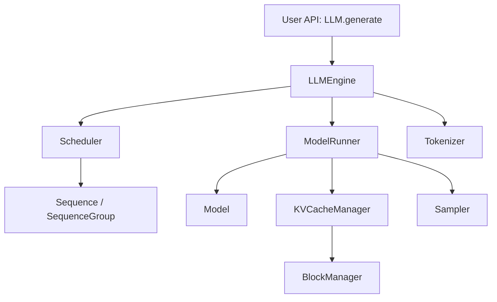

# Architecture

## 总体分层



## 核心模块

### LLM

对外入口。负责把用户输入转换为 engine 请求，并把内部输出整理为用户可读结果。

第一阶段只需要同步 `generate`。后续再考虑 async、streaming 和 server。

### SamplingParams

保存生成参数。它应该只负责参数表达和校验，不负责采样逻辑。

### Sequence

表示一个请求的生命周期。

建议字段：

- prompt
- prompt_token_ids
- output_token_ids
- status
- max_tokens
- finish_reason
- block_table

### Scheduler

决定每一步哪些 Sequence 进入模型执行。

早期可以很简单：

- waiting queue
- running list
- finished list
- max_num_seqs
- max_num_batched_tokens

### ModelRunner

封装模型前向逻辑。

早期职责：

- token tensor 准备
- attention mask 准备
- 调用模型 forward
- 返回 logits 和 cache

后期职责：

- prefill/decode 分支
- slot mapping
- block table
- CUDA graph 或 torch.compile

### Sampler

输入 logits 和 SamplingParams，输出 next token。

先实现：

- greedy
- temperature
- top_k
- top_p

### KVCacheManager

早期可以没有独立模块，先使用 Transformers 返回的 `past_key_values`。

进入 Phase 5 后再抽象：

- 申请 block
- 释放 block
- 维护 block table
- 生成 slot mapping

## 数据流

### MVP 单请求

```text
prompt
  -> tokenizer
  -> model prefill
  -> logits
  -> sampler
  -> append token
  -> model decode
  -> repeat until EOS or max_tokens
  -> tokenizer.decode
```

### Batch + Scheduler

```text
new prompts
  -> Sequence objects
  -> Scheduler waiting queue
  -> Scheduler selects running batch
  -> ModelRunner step
  -> Sampler
  -> update Sequence state
  -> finished sequences leave running
```

### Paged KV Cache

```text
Sequence token position
  -> logical block id
  -> physical block id
  -> slot in global KV cache tensor
```

## 设计原则

- 先正确，再快。
- 先单请求，再多请求。
- 先普通 KV cache，再 paged KV cache。
- 每个复杂概念都要有小测试。
- 不要把 Scheduler、ModelRunner、Sampler 混在一起。
- 不急着抽象过度，等重复出现后再抽象。

